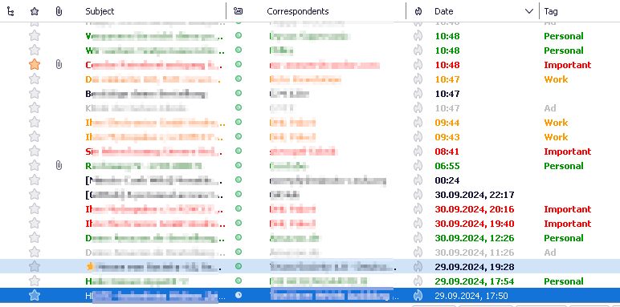
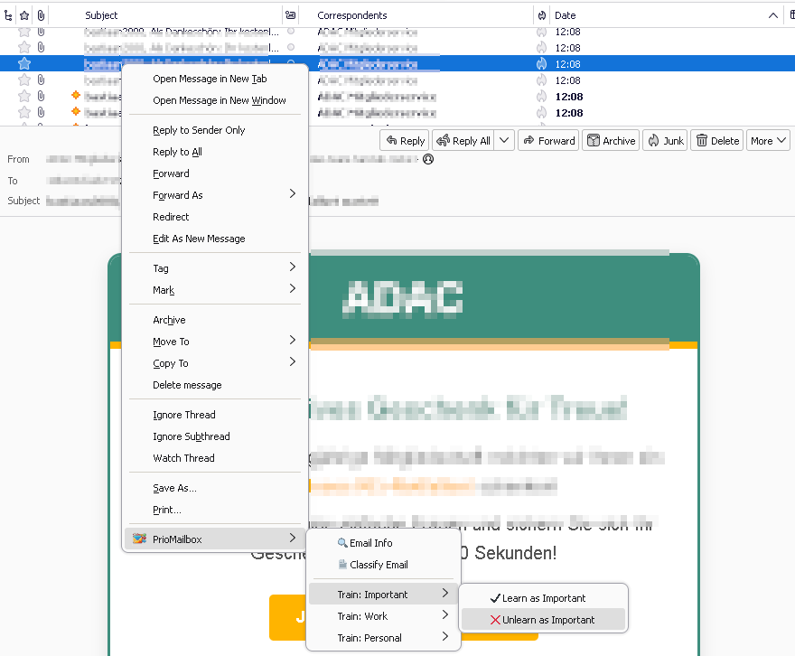
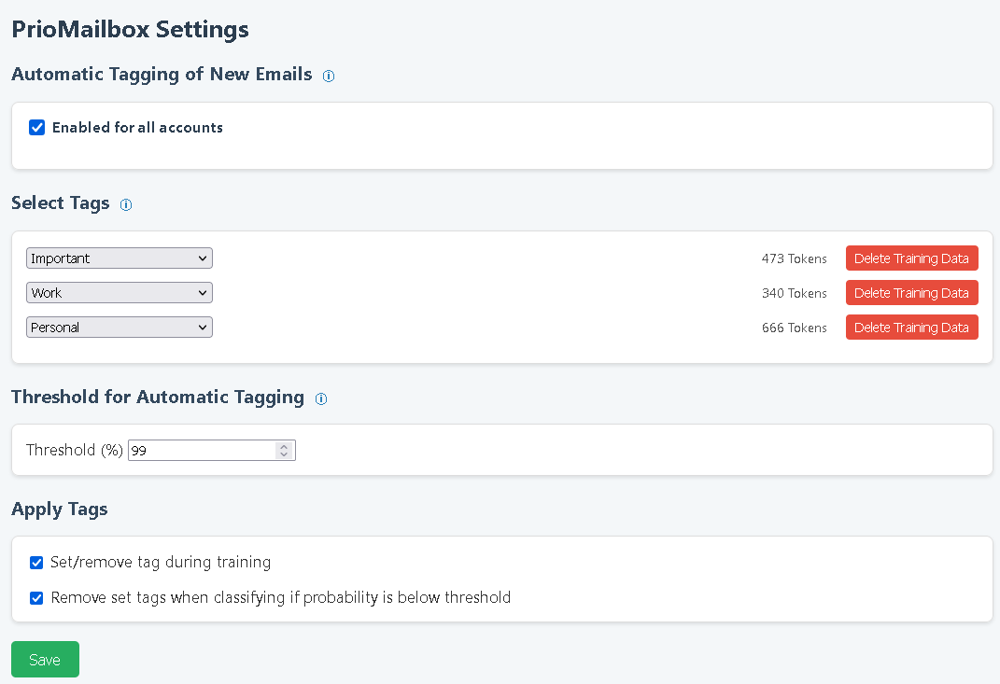
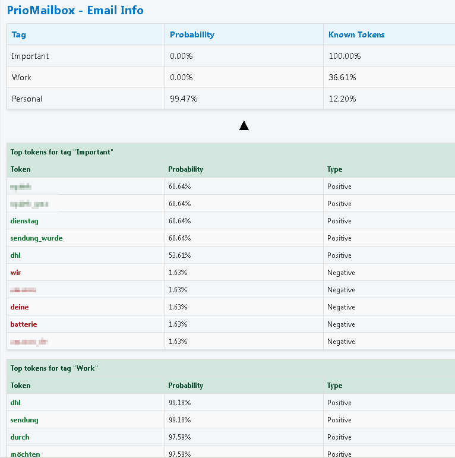

# PrioMailbox

PrioMailbox is a simple, powerful email organization add-on for Thunderbird that helps you manage your inbox efficiently by automatically tagging (highlighting) important emails and dimming less important ones. With PrioMailbox, prioritize your communication effortlessly and keep your focus where it matters most.

## Features

- **Automatic Email Prioritization**: Leverages trainable filters to prioritize important emails and dim non-priority emails.
- **Privacy-Focused**: All data is processed and stored locally, ensuring your privacy is never compromised.
- **Customizable Filters**: Train filters based on your email habits and preferences.
- **User-Friendly Interface**: Easy to use with a minimal learning curve.

## Installation

To install PrioMailbox on your Thunderbird client:

1. Download the latest release from the [Releases]page.
2. Open Thunderbird and go to `Add-ons and Themes`.
3. Click on the gear icon and select `Install Add-on From File`.
4. Navigate to the downloaded `.xpi` file and select it.
5. Follow the prompts to install the add-on.

## Usage

Here's how to get started with PrioMailbox after installation:

### Training Filters

1. Navigate to the PrioMailbox settings panel.
2. Choose the keywords that you want to be automatically tagged.
3. Train the filters by right-clicking on emails and selecting the appropriate keyword under the PrioMailbox menu.

### Checking Email Classification

To test the filter's effectiveness:

- Select several emails that have not been used for training.
- Right-click and choose `Classify Email` from the PrioMailbox menu to see the automatic classification in action.

### Screenshots

Here are some visuals of PrioMailbox in action:

***
**Email list showing applied tags.**  

***
**Training a tag with an email.**  

***
**Addon settings panel.**  

***
**Statistical insights into email classification for interested users.**  

## Contributing

Contributions to PrioMailbox are welcome! Here are a few ways you can help:

- **Report Bugs**: Submit bug reports and feature requests through [GitHub Issues](https://github.com/yourusername/priomailbox/issues).
- **Submit Pull Requests**: Feel free to fork the repository and submit pull requests with new features or improvements.

## License

PrioMailbox is released under the [MIT License](LICENSE).
